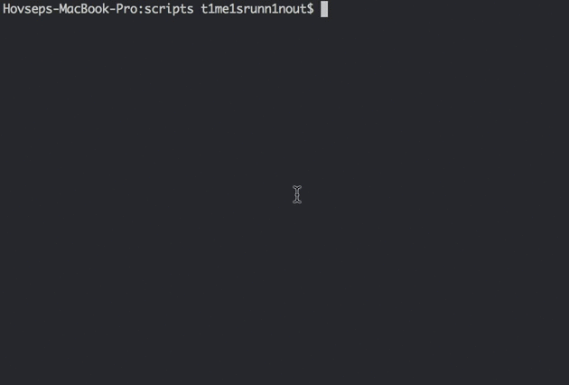

# Node API Mashups

This project accesses the Spotify and Twitter APIs from the command line and takes the following as inputs:

`node app.js` followed by:
- `my-tweets [string]`
- `movie-this [string]`
- `spotify-this-song [string]`
- `do-what-it-says`
The first 3 take one additional parameter enclosed in 'quotes'.

## Installing

Run `npm i`
You will need to include a file with your API keys for Twitter and Spotify.

## Built With

* Node JS
* Moment
* Chalk
* node-spotify-api
* Request
* twitter

## License

This project is licensed under the MIT License